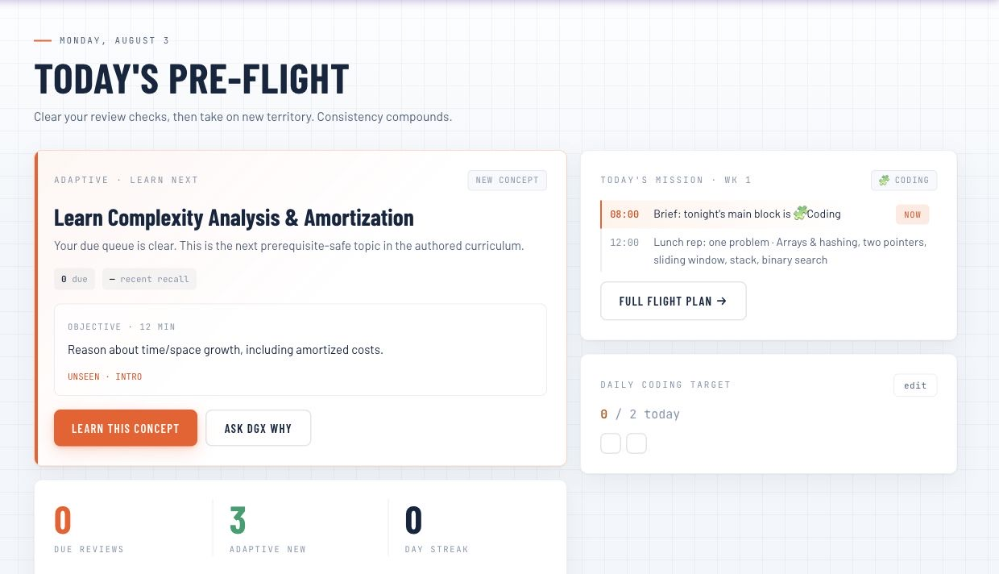
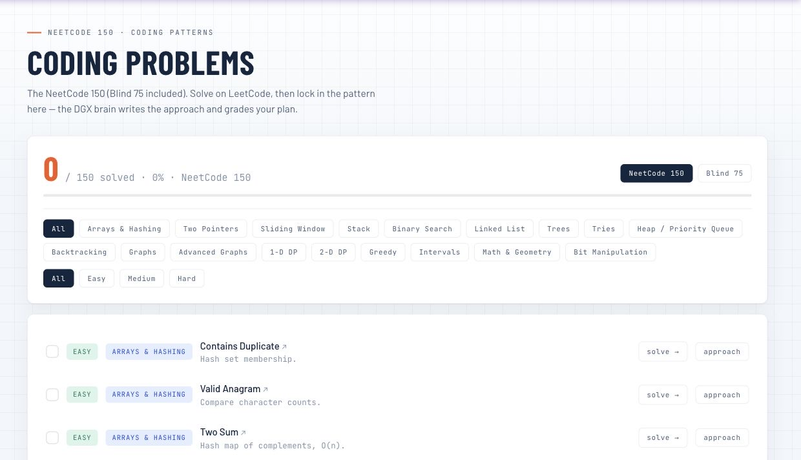

# PrepPilot


A daily senior-SWE interview trainer with spaced repetition, an AI tutor, and a
self-growing curriculum. Built to run on the **Mac mini** and use the **DGX**
(`qwen3.6:35b`) as its reasoning brain over Tailscale.

<p align="center">
  
  
</p>

## What it does
- **Daily "pre-flight"** — due spaced-repetition reviews + a few new topics each day, with a streak.
- **Adaptive "Learn Next"** — adjusts new-topic load from recent recall and due reviews, explains the choice, and previews what comes next.
- **SM-2 spaced repetition** — everything you learn is scheduled for review so it sticks.
- **DGX diagnosis** — on demand, the local model interprets recent mistakes, names a teaching focus, and asks a targeted retrieval question without controlling the scheduler.
- **Two graders** — MCQs graded instantly; free-text / whiteboard answers graded by the DGX brain with senior-level feedback.
- **Self-updating** — a nightly job authors fresh, stack-relevant concepts (Go / Python / TS / React / cloud / Terraform). Also on demand from the Syllabus page.
- **Ask the tutor** — free-form Q&A and system-design coaching.
- **Flight log** — accuracy, per-track mastery, 14-day activity.
- **Login** — single-user cookie auth (required; the mini's tailnet is shared).

## Architecture
```
Browser ──HTTPS (Tailscale Serve :10000)──▶ Mac mini
                                             └─ FastAPI + SQLite (uvicorn :8778, LaunchAgent)
                                                   └─ HTTP ──▶ DGX ollama (qwen3.6:35b) @ $OLLAMA_URL
```
- **Backend:** FastAPI + SQLModel/SQLite, Python 3.12 via `uv`. `backend/app/`
- **Frontend:** React + Vite + TS, built to `frontend/dist`, served by FastAPI.
- **Brain:** `think=False` ollama chat calls (the model routes to hidden reasoning otherwise).

## Local development
```bash
# backend (terminal 1)
cd backend && uv sync && uv run uvicorn app.main:app --port 8899 --reload
# frontend (terminal 2) — proxies /api to :8899
cd frontend && npm install && npm run dev   # http://localhost:5177
```

## Deploy / update the mini
```bash
./deploy/deploy.sh          # builds, rsyncs, installs deps, (re)loads LaunchAgent, sets Tailscale Serve
```
The deploy target is read from `deploy/deploy.env` (untracked) — see `deploy/deploy.env.example`.
Then open `https://<your-machine>.<your-tailnet>.ts.net:10000` and set your passcode on first visit.

## Tuning
`backend/app/config.py` — `new_topics_per_day`, `max_reviews_per_day`,
`daily_generation_hour`, `model`, `ollama_url`. Curated content lives in
`backend/app/content/curriculum.py`; add concepts there and restart to seed them.

## Service management (on the mini)
```bash
launchctl unload/load ~/Library/LaunchAgents/com.preppilot.server.plist
tail -f ~/Library/Logs/preppilot.log
```
